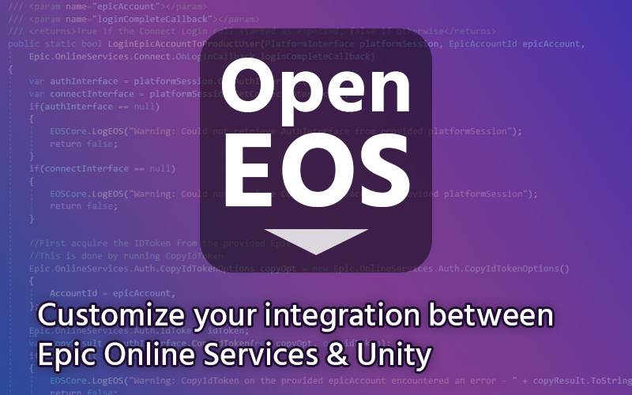
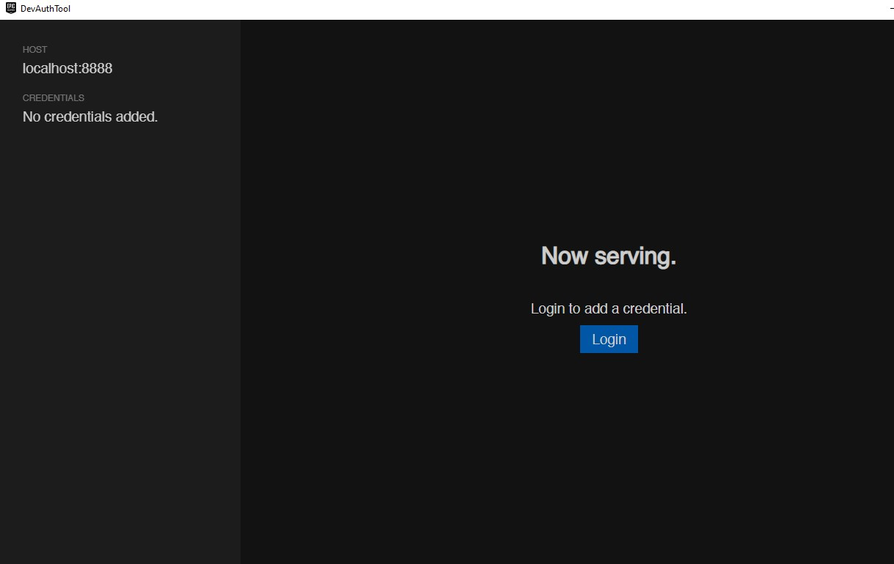
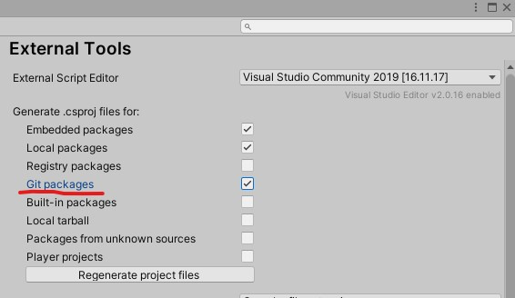

# OpenEOS for Unity
[](https://openupm.com/packages/com.robproductions.openeos/) 

An open-source port of the [Epic Online Services (EOS) SDK](https://dev.epicgames.com/docs/epic-online-services) in Unity Package format, with minor enhancements to provide a clean integration between EGS and Unity.



## Overview

OpenEOS offers 2 main services to your Unity project:

1. A port of the relevant EOS SDK files, including the C# codebase and DLLs configured to work within the Editor and builds. This allows you to import the EOS SDK as a package instead of having to manage the SDK on a project-by-project basis in your Assets folder.
2. A few helper extensions and shortcuts for commonly used Epic Online Services features, such as SDK Initialization and Account Management.

### OpenEOS... Why?

When researching the EOS SDK for use in my own projects, I was surprised to see only one or two usable plugins for integration with Unity (at the time of writing). Looking into those, they're pretty robust in their own right. However, they seem to offer full "manager" solutions that don't allow for much customization and essentially sit completely on top of the regular Online Services library.

My goal for OpenEOS was to provide a more lightweight solution that can easily be deployed to all of my projects; something more organized than Epic's recommended "drag and drop into Assets" workflow but more customizable than the existing EOS Manager packages out there today. Overall, I set out to create a package that lets you jumpstart *your own* EOS Manager which can be customized per project while also eliminating a lot of redundant work with some helpful extensions. As such, this is not a complete solution by any means and you'll be expected to write your own EOS Manager that interfaces with the OpenEOS layer or the EOS SDK directly.

If you're looking for a more robust solution that comes with its own manager, I highly recommend [PlayEveryWhere's EOS Plugin for Unity](https://github.com/PlayEveryWare/eos_plugin_for_unity). The package is officially recommended by Epic and will quickly get your project set up if you don't care about fine tuning your implementation of the SDK. I also want to thank [Dylan Hunt's EOS-Unity project](https://gitlab.com/dylanh724/eos-unity) as it helped me understand the common init steps for EOS. I believe the project is deprecated now but still serves as a useful reference for getting set up with the SDK.

### How should I use OpenEOS?

You can use OpenEOS in either or both of the following ways:

1. A neatly packaged container for the EOS SDK that you can interface with directly by importing the Epic.OnlineServices namespace into your custom setup code.
2. A set of extensions that themselves can interact with the packaged SDK which provide helper functions to let you more quickly get around the SDK. Simply import the RobProductions.OpenEOS namespace and you can use the *EOSCore*, *EOSAuth*, and *EOSEnv* static libraries to quickly implement some common SDK steps: Initialization, Shutdown, Auth system login, Connect system login, translating EpicAccountId to ProductUserId, and acquiring command line arguments passed from the EGS Launcher.

## Versioning

Since this package is both a port of the EOS SDK and an extension, there is the unique challenge of versioning since the package code builds on top of the included EOS SDK version. Since users likely care about which version of the SDK they are integrating and are compatible with, the Release Number will be laid out like this:

*X.X.X-Y.Y.Y* where X.X.X is the package code version and Y.Y.Y is the Epic Online Services SDK version. Example: 1.3.0-1.15.2 means package version 1.3.0 targeting EOS SDK version 1.15.2.

Unfortunately, since Unity [enforces the SemVer system in the package.json](https://docs.unity3d.com/Manual/upm-semver.html), the scheme laid out above will only be viewable from Github itself, so use the release tags as a reference for what code version maps to which SDK version. Within the package manager itself, you will only see X.X.X, so it's up to you to know how that corresponds to the EOS SDK version.

**Current EOS SDK Target:** 1.16.1

### Disclaimer

Updates to the EOS SDK itself will constitute a new package code version so that the package.json can reflect a different version for the change. However, it's unlikely that the package would ever travel backwards in target EOS version, so expect that package updates will only ever update the SDK forwards. *Example: If you're looking for package version 1.3.0 targeting SDK 1.14 but version 1.2.0 already targeted 1.15.2, you're out of luck unless a specific branch or release is created.* An exception can be made in the future if there is demand for it.

## Usage

As mentioned above, you could use this package to simply interface with the SDK directly or utilize some wrapper shortcuts provided by OpenEOS. Let's start with the first use case.

### Accessing Epic Online Services SDK

Once the package is installed, you simply need to import whatever EOS namespace you'd like to begin working with the SDK inside your own EOS Manager. This could be Epic.OnlineServices, Epic.OnlineServices.Auth, Epic.OnlineServices.Connect, etc. See [Epic's EOS documentation](https://dev.epicgames.com/docs/epic-online-services) for more info on how to use these services. The [C# getting started page](https://dev.epicgames.com/docs/epic-online-services/eos-get-started/eossdkc-sharp-getting-started) is also helpful as it provides some setup steps for working with Unity. If you import this package, you can forgo the first few steps where you import the SDK and configure the DLLs.

The [EOS SDK API](https://dev.epicgames.com/docs/api-ref) is helpful for viewing how the interfaces work and what parameters they expect. If you're new to the EOS SDK I'd recommend first understanding the full flow that Epic expects from your project. You can use [this doc page](https://dev.epicgames.com/docs/epic-online-services/eos-get-started/introduction-resources) to learn a bit more about it, though it's hard to find any solid steps without looking through examples. I will briefly summarize the expected flow you have to take within your EOS Manager here:

1. Initialize the SDK (in Editor mode, this is a little more complicated as you have [dynamically load and unload](https://dev.epicgames.com/docs/epic-online-services/eos-get-started/eossdkc-sharp-getting-started) the EOS Libraries)
2. Acquire the PlatformInterface which acts as your EOS session and ensure that you call .tick() on some time interval
3. Use Auth system to log in an Epic User (if you wish to provide that option)
4. Use the Connect system to log in a generic user through some provider, or convert the Epic User into the generic Product User
5. Use the stored PlatformInterface and user data whenever you need to interact with the SDK, for example unlocking Achievements or uploading statistics
6. Shutdown the SDK on App exit and release the memory used by the PlatformInterface

### EOSCore Layer

If you'd like a slightly easier time performing common core SDK steps within your EOS Manager, you can import the RobProductions.OpenEOS namespace and use the helper functions provided by EOSCore to initialize and shutdown the SDK. All of the code contains summary comments so you can read about what each function does in your IDE.

**EOSCore.Init()** will automatically initialize the SDK. It uses the custom EOSInitSet class for you to provide your init configuration, mainly the 5 secret IDs that can associate your app with the EOS service. You can find the secret IDs required for setup in your developer portal. Read more about the developer portal [here](https://dev.epicgames.com/docs/dev-portal/product-management). Additionally, Init() requires the project path to the OpenEOS installation. With the new *"InstallationPathType"* enum, you can have Init automatically find your installation path by telling it how you installed OpenEOS. 

Alternatively, you could use the custom path type and provide the *customPathToOpenEOS* to manually specificy your installation location. For this method, assume we start at the root of the project and search from there; for example if you installed via the Package Manager remote method, provide something like *"Library/AssetCache/com.robproductions.openeos@someuniqueid"* as shown in your file browser. 

The installation path parameters are only used in Editor mode so that EOSCore can locate the Plugins folder contained within the EOSSDK folder and dynamically load in EOS DLLs before running the main init steps. This is the recommended approach described in the [C# Getting Started page](https://dev.epicgames.com/docs/epic-online-services/eos-get-started/eossdkc-sharp-getting-started). This allows you to completely shutdown the SDK even in Editor at a later time without having to worry about the lifetime of the Unity Editor itself. As of 1.15, the documentation claims that this is the required method for initializing the SDK properly within the Unity Editor.

With just those 2-3 parameters as input into **EOSCore.Init()**, you can quickly start up the SDK and retrieve the **PlatformInterface** that you should use in all future requests to the SDK. As long as the returned platform wasn't null, you have successfully started up the SDK. Here's an example:

```cs
var initSet = new EOSInitSet()
{
	productName = "Test Game",
	productVersion = "V1.1",
	clientID = "------------------",
	clientSecret = "-----------------",
	productID = "--------------------",
	sandboxID = "--------------------",
	deploymentID = "----------------",
};

platform = EOSCore.Init(initSet, EOSCore.InstallationPathType.CustomPath, "Assets/MyPackages/OpenEOS/");

if(platform != null)
{
	initialized = true;
}
```

Remember to call .Tick() at least a few times per second on the provided PlatformInterface so that EOS can continue running. 

In order to determine which SandboxID and DeploymentID you should use, you may be able to use **EOSEnv.GetSandboxID()** to grab a command line parameter which is passed into your app by the Epic Games Launcher. See below for more details on EOSEnv. As per [Epic's testing guide](https://dev.epicgames.com/docs/en-US/epic-games-store/testing-guide), they recommend to use this method to determine your initialization so that you can use the same build on Dev which is eventually pushed to Live. When a user launches in Dev, Stage, or Live sandbox, you will you be able to detect that version and change your EOSInit set. However it is up to you to test this and add in fallback logic should this or if a user attempts to run your app outside of the EGS Launcher.

**EOSCore.Shutdown()** will run all the necessary cleanup steps to shut down the SDK. It requires the generated PlatformInterface that was handed to you from Init() so that it can release the memory allocation for your session. Additionally, it dynamically unloads the libraries that were linked in Init() by using Bindings.Unhook. If you used Init() you must use Shutdown() at the end of your application lifecycle, typically in OnApplicationQuit or OnDestroy if you only have one scene.

### EOSAuth Layer

EOSAuth provides helpful shortcuts for working with EOS accounts and the user systems. There are 2 main login systems for EOS: Auth and Connect. 

**EOSAuth.LoginAuth()** lets you login a user via the Auth system. The Auth system relates to Epic accounts only. Provide the custom EOSLoginAuthSet class with the Credentials filled out and LoginAuth() will run the async operation within the SDK. To get the result, pass in the OnLoginCallback which is invoked when the operation is complete. Based on the ResultCode, Login may have been successful or failed due to various reasons. Epic recommends that you attempt multiple types of Login for convenience, i.e. Persistent Auth to see if a session is already stored -> Exchange Code coming from the launcher itself -> AccountPortal as a fallback which opens up a web browser, with each type only activating if the previous failed. Once you get a result, you can grab the given EpicAccountId as a reference to your Epic user. Learn more about the Auth Interface [here](https://dev.epicgames.com/docs/epic-account-services/auth/auth-interface).

For the Exchange Code Login type, you will need to grab the user token argument from the command line. Use **EOSEnv.GetExchangeCodeToken()** to quickly grab this token from the System Environment. Note that this will definitely fail in the Editor so it is up to your EOS Manager to determine when to use this Login type.

Note that in order to use the "Developer" login type to test your login system, you will need to run the DevAuthTool provided by the SDK [which you can download from your developer portal](https://dev.epicgames.com/docs/epic-online-services/eos-get-started/services-quick-start#step-2---download-the-eos-sdk).



Great, so you've got an EpicAccountId. Unfortunately, this only gets you so far as some of the SDK expects a reference to a more generic type of user called a Product User, which you must log in using the [Connect Interface](https://dev.epicgames.com/docs/game-services/eos-connect-interface). With the Connect system, you can either attempt to translate your Epic user (via EpicAccountId) or use a verified provider service to log your user in (via Google, Steam, Playstation, etc.)

**EOSAuth.LoginConnect()** is a wrapper for the Connect login process. It takes the Credentials of user and some optional additional information in the custom EOSLoginConnectSet data container, and a callback that you provide which returns to you the ResultCode of the async operation. With an external provider, you can fill out the expected credential type and include the relevant information, but for an Epic user you'll want to use the EpicIdToken type and then use Auth.CopyIdTokenOptions() to retrieve the idToken of your user before placing it into the credentials.

Since this translation seems like a pretty common process and is somewhat complicated, I've included a few encapsulating functions that can internally handle this conversion from EpicAccountId to ProductUserId without needing to call EOSAuth.LoginConnect() yourself. 

**EOSAuth.LoginEpicAccountToProductUser()** will attempt to generate the idToken when given an EpicAccountId and automatically call EOSAuth.LoginConnect(), handing over your provided callback to get the result. There is one issue with this approach though, and it's that the operation could fail due to the Connect user not existing in the EOS service. Since this only attempts to log in, the link will between the Epic User and the Product User may not have been made yet. To learn how to fix this, you can check [this resource](https://dev.epicgames.com/docs/en-US/api-ref/functions/eos-connect-create-user) or use the following helper function.

**EOSAuth.LoginEpicAccountToProductUserWithCreate()** will do the same as the previous function, but with the added step of creating the Connect user if it has not been linked yet. It will return a result to either the Login callback or the CreateUser callback that you provide. Now, when you get a result from either one of these, you can check for success and grab the ProductUserId that was either created or logged in as a result of the operations.

**EOSAuth.LoginEpicAccountToProductUserWithCreate()** has an override which acts as the final abstraction for this conversion process. Instead of providing 2 separate callbacks, you provide one custom callback called CreateOrLoginPUIDCallback which returns the result from either the CreateUser op or the Connect Login op 

With the provided helper functions your complete login flow could look something like this if you want simple Epic User verification:

1. Run the EOSAuth.LoginAuth() with Persistent Auth type and provide a callback to check the result
2. If Persistent Auth failed, run EOSAuth.LoginAuth() again in the previous callback with Account Portal instead
3. If Account Portal was successful, run EOSAuth.LoginEpicAccountToProductUserWithCreate() and provide a callback that stores the resulting ProductUserId
4. Now you have all the user identification necessary to access a vast majority of the SDK functionality

Hopefully this example demonstrates how OpenEOS lets you customize your Auth flow while minimizing the amount of complicated manual conversions needed to complete the Authorization process.

### EOSEnv Layer

EOSEnv provides some utilities for getting values from the command line, which the EGS Launcher utilizes to tell you information about the running environment.

**EOSEnv.GetAllCommandLineArgs()** will help you debug all of the parameters passed into your app.

**EOSEnv.GetCommandLineArgValue()** returns the value of the parameter when given a name. Epic formats their arguments like -NAME=VALUE, so provide the NAME here to get back the value which is trimmed out internally.

Here are some automated value getters which you might find helpful:

- **GetExchangeCodeToken()** provides the password token for the ExchangeCode Auth login type.
- **GetSandboxID()** provides the ID of the running sandbox. When you give a tester a key to play your game on EGS, the Sandbox type you generated the key from will determine which build they are granted. For example, they can run the "Stage" version from EGS in addition to "Dev" or Live. When this happens, the version they click on in the launcher will determine the SandboxID passed into this argument. Your app may then grab this value and use it for Initialization so that the same build can be used across any sandbox. i.e. upload to Dev sandbox and push the same build to Stage.

Do note that any of these tokens could be missing for any reason and OpenEOS will print a warning in that case.

## Installation

### Recommended Installation

If you're looking for any specific release of OpenEOS, you can specify a release tag with the hashtag like so: "https://github.com/RobProductions/OpenEOS.git#ReleaseNumber"

1. Open the [Package Manager](https://docs.unity3d.com/2020.3/Documentation/Manual/upm-ui.html) in Unity
2. Copy the GitHub "HTTPS Clone" URL for OpenEOS: [https://github.com/RobProductions/OpenEOS.git](https://github.com/RobProductions/OpenEOS.git)
3. Click the '+' icon and hit *"Add package from git URL"*
4. Paste the HTTPS Clone URL to the popup and (optionally) add on *#YourChosenReleaseNumer* to the end, then hit enter
5. Wait for download to complete
6. You can now import RobProductions.OpenEOS namespace and Epic.OnlineServices namespace into your EOS manager to start using the SDK and quick service functions

Note that if you did not specify a release number, hitting the "update" button from Unity package manager may bump up not only the package version but the underlying EOS SDK version which may result in incompatibilities with your EOS code, so use it wisely and prepare for issues. 

### Optional Installations

**OpenUPM installation**

Check [this link](https://openupm.com/docs/getting-started.html#installing-a-upm-package) for the recommended steps.

**Local package installation**

Feel free to download the project as .zip and place it somewhere on your local drive. Then use the *"Add package from disk"* option in the Package Manager to add this local package instead of the remote installation. Ensure the resulting folder in your project's Package directory is com.robproductions.openeos or com.robproductions.openeos-main so that Init can discover the installation directory correctly.

**Installation failed or Unity not supported?**

If installation fails due to version requirements, you may be able force OpenEOS to work by downloading the project as .zip and editing the "package.json" file to lower the Unity requirement. Then use the *"Add package from disk"* option to add your custom version instead. 

**Assets path installation**

OpenEOS should also work as a part of your Assets/ directory if you'd like to customize it for your specific project without having to deal with the package system. Simply download the project as a .zip and place the contents anywhere in your Assets folder, as long as they are self-contained so that the Assembly Definition doesn't confuse itself with your other files. Note: when specifying the OpenEOS installation path in EOSCore.Init, you must now use Assets/path_to_openEOS.

### Want more details about the API?

If you installed via Git, you may want to make sure that you've enabled .csproj for "Git Packages" in *Edit->Preferences->External Tools*



Now you'll be able to see summary comments including descriptions on return values, input parameters, and functions straight from your IDE. This is especially helpful because it lets you view Epic's summary comments within the EOS SDK itself in addition to the enhancements provided by OpenEOS. Feel free to poke around the code to understand what it's doing behind the scenes :)

## Updates & Contribution

For now, updates to the EOS SDK will happen manually and likely infrequently since I personally don't always need the latest version for my projects. In the future it would be great to have some automated batch process that places the SDK files correctly and renames the DLL holder to "Plugins" etc. so that can be something to improve in future releases.

### How to Contribute

This open source project is free for all to suggest improvements, and I'm hoping that more contributors could help extend the shortcut abstractions and add further features as suggested by the community. These are the recommended steps to add your contribution:

1. Fork the repository to your GitHub account
2. Clone the code to the Assets or local Packages folder in a testbed Unity project
3. Create a new branch or work off of your own "working branch"
4. When your changes are complete, submit a pull request to merge your code; ideally to the "working-branch" used to test changes before main
5. If the PR is approved, aggregate changes will eventually be merged into main and a new release tag is created

## Credits & Details

Created by [RobProductions](https://twitter.com/RobProductions). RobProductions' Steam games can be found [here](https://store.steampowered.com/developer/robproductions).

### Requirements

- Tested with Unity 2020.3.26f1 and .NET 4.x, though it will likely work in earlier versions of Unity too. If support is confirmed for older versions I will gladly update the package JSON to improve compatibility.

### Limitations

- I mainly focused on developing this package for my own use cases which are geared towards PC and Mac deployment. As such, the SDK DLLs are only configured for Windows (32-bit and 64-bit), Mac, and Linux. Mobile platforms such as iOS and Android are not supported currently as I don't have those modules installed in my testing project. DLL conflicts also forced me to remove those libraries for now. If support was confirmed in the future, the DLLs for iOS and Android could be configured correctly and might work with the rest of this project.
- Due to my own limited use cases for this package, some steps of the SDK Initialization and Login process are simplified and definitions for more advanced configurations are not yet available. These are relatively easy to update, so if you have need of more options in the EOSCore feel free to let me know.
- Currently the enhancements are mainly limited to SDK initialization, shutdown, and account authorization. This is because EGS Self-publishing only opened up a few days ago at the time of writing, so I haven't had time to look through more of the important SDK features. Also, these are the steps that are most relevant for my use case which will be performed often from my own EOS Managers. Other parts of the SDK I need such as Achievements are relatively simple in comparison, just needing a ProductUserId and string ID, so I felt that no helper functions were necessary and I could implement them directly from my EOS Manager. In the future as I discover more use cases for the SDK I may try to branch out and add more wrappers for commonly-used features. 

### License

The Epic Online Services SDK that is bundled in this package is subject to the license agreement found on [Epic's Developer Agreement page](https://dev.epicgames.com/en-US/services/terms/agreements).

This rest of this work is licensed under the MIT License. The intent for this software is to neatly package the Epic Online Services SDK and extend it freely and openly, without requirement of attribution. However, attribution for uses of this package would be much appreciated. The code may be considered "open source" and could include snippets from multiple collaborators. Contributors may be named in the README.md and Documentation files. 

The code is provided "as is" and without warranty. 
